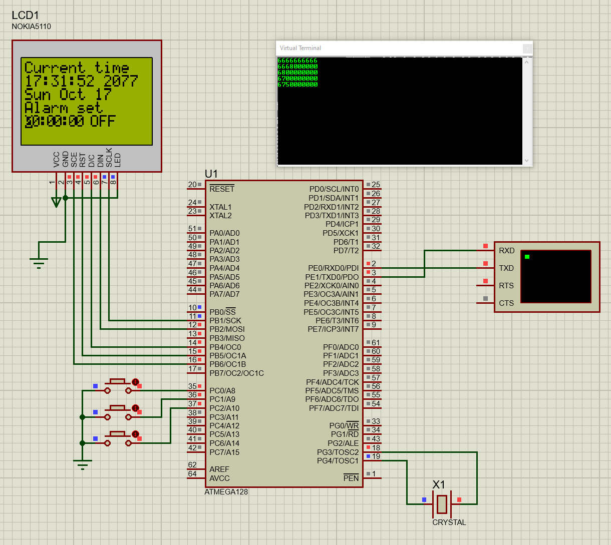

Для задания: 

Собрать схему часов и составить программу вывода на жидкокристаллический дисплей типа PCD8544, используя встроенный в микроконтроллер таймер. Реализовать функцию будильника, реализовать установку времени через терминал(UART).

